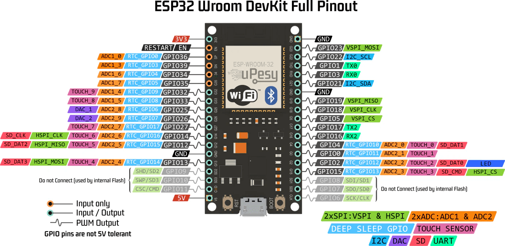

# ESP-Home Sensor Network Project

## Overview

This project manages a distributed IoT sensor network using ESP32 microcontrollers with ESPHome. The system consists of independent remote sensor nodes that communicate directly with a central Home Assistant instance for comprehensive environmental and infrastructure monitoring.

### Architecture 

```text
┌────────────────────────────────────────────────────────────┐
│                    Home Assistant                          │
│          (Raspberry Pi Docker Swarm - Central Hub)         │
└──────┬──────────────────────────────┬──────────────────────┘
       │                              │
       │                              │
┌──────▼──────────────────┐   ┌──────▼──────────────────────┐
│   Sensor Node 01        │   │   Sensor Node 02            │
│   (Bedroom Monitor)     │   │   (Cluster Monitor OLED)    │
│  - DHT22 Temp/Humidity  │   │  - BMP280 Temp/Pressure    │
│  - BMP280 Pressure      │   │  - Remote Pi CPU Temp      │
│  - MQ-2 Flammable Gas   │   │  - Remote Pi CPU Usage     │
│  - MQ-7 Carbon Monoxide │   │  - Remote Pi RAM Usage     │
│  - MQ-135 Air Quality   │   │  - Dual Fan Control        │
│  - LDR Brightness       │   │  - Hysteresis Logic        │
│  - PIR Motion Sensor    │   │  (Alternative: LCD 1602)   │
│  - OLED Display 128x64  │   │  - OLED Display 128x64     │
│  - 7-Segment MAX7219    │   │  - Time/Date Display       │
└─────────────────────────┘   └────────────────────────────┘
```

### Components

*   **Sensor Node 01** (`esphome-sensor-node-01.yaml`): Comprehensive bedroom environmental sensor with multi-parameter monitoring and dual display outputs.
*   **Sensor Node 02** (`esphome-sensor-node-02.yaml`): LCD-based cluster monitor for Raspberry Pi infrastructure with temperature-controlled fan management.
*   **Sensor Node 02 OLED** (`esphome-sensor-node-02-oled.yaml`): OLED variant for remote Pi monitoring with scheduled display automation.

#### Current Features

*   **Connectivity:** WiFi with automatic fallback AP for recovery
*   **Integration:** Native Home Assistant API with encryption
*   **Web Access:** Built-in web server on port 80 for local interface
*   **Diagnostics:** Status LED (GPIO 2) with motion-triggered alerts
*   **Local Display:** OLED and numeric 7-segment displays for real-time readout
*   **Updates:** Secure OTA (Over-The-Air) wireless updates after initial flash
*   **Environmental Sensing:** Temperature, humidity, pressure, air quality (gas), brightness, and motion detection
*   **Remote Monitoring:** Home Assistant sensor integration for remote infrastructure monitoring
*   **Smart Control:** Multi-stage hysteresis fan control with temperature thresholds
*   **Time Sync:** SNTP internet clock with timezone support
*   **Automation:** Scheduled display on/off (07:00 AM - 06:00 PM)

### Technical Specs

*   **Board:** ESP32-DEV (NodeMCU-32S compatible)
*   **Framework:** ESP-IDF (optimized for memory and performance)
*   **Minimum ESPHome Version:** 2025.11.0
*   **Python Version:** 3.8+

## Hardware Reference

<p align="center">
    
</p>

## File Structure

```text
esp-home/
├── esphome-sensor-node-01.yaml       # Node 1: Bedroom environmental sensor
├── esphome-sensor-node-02.yaml       # Node 2: LCD cluster monitor
├── esphome-sensor-node-02-oled.yaml  # Node 2: OLED cluster monitoring
├── secrets.yaml                      # WiFi and API credentials (not versioned)
├── LICENSE                           # Project license
├── README.md                         # This file
├── docs/
│   ├── Node01WiringGuide.md          # Detailed wiring guide for Node 01
│   ├── Display7Segments.md           # MAX7219 7-segment display configuration
│   ├── TempSensorDHT11.md            # DHT11/DHT22 sensor integration guide
│   └── FanController.md              # Fan control circuit documentation
├── fonts/
│   └── materialdesignicons-webfont.ttf
└── images/
    ├── ESP32-Pinout.png
    ├── DHT11.png
    ├── display-tm1637.jpg
    └── (other hardware reference images)
```

## Setup Instructions

### Prerequisites

*   ESPHome installed (CLI or Docker Desktop)
*   Home Assistant instance (Raspberry Pi with Docker recommended)
*   ESP32 Development Boards (NodeMCU-32S or similar)
*   USB Cable (USB 2.0 or 3.0 with data transfer capability)
*   Chromium-based browser (Google Chrome, Microsoft Edge, or Brave)
*   Git (for cloning the repository)
*   Python 3.8+ (if running ESPHome CLI locally)

### Installation Steps

#### 1. Clone or Download This Project

```bash
git clone https://github.com/Robson16/esp-home
cd esp-home
```

#### 2. Create and Configure Secrets

Create `secrets.yaml` in the root directory with your network credentials:

```yaml
# WiFi Credentials
wifi_ssid: "YOUR_WIFI_SSID"
wifi_password: "YOUR_WIFI_PASSWORD"

# Node 01 Encryption Key (generate with: python3 -c "import secrets; print(secrets.token_hex(16))")
node1_api_encryption_key: "GENERATED_16_BYTE_HEX_KEY"

# Node 02 Encryption Key
node2_api_encryption_key: "GENERATED_16_BYTE_HEX_KEY"

# Shared Secrets
node_ota_password: "SECURE_OTA_PASSWORD_HERE"
node_fallback_ap_password: "SECURE_FALLBACK_PASSWORD_HERE"
```

**CRITICAL:** Never commit `secrets.yaml` to version control! Add it to `.gitignore`:
```bash
echo "secrets.yaml" >> .gitignore
git add .gitignore && git commit -m "Add secrets.yaml to gitignore"
```

#### 3. Validate Configuration Files

Check YAML syntax before flashing:

```bash
esphome config esphome-sensor-node-01.yaml
esphome config esphome-sensor-node-02.yaml
```

#### 4. Flash the First Node (Web Dashboard)

The easiest method for initial setup:

```bash
esphome dashboard .
```

Open `http://localhost:6052` in your web browser.

**Steps:**
1.  Connect ESP32 to your computer via USB
2.  Click **Install** on the desired node card (Node 01, Node 02, etc.)
3.  Select **"Plug into this computer"**
4.  Choose the COM port (e.g., COM3, COM4)
5.  If the progress bar stalls at "Connecting...", press and hold the **BOOT** button on the ESP32
6.  Wait for the flash to complete
7.  Node will restart automatically and attempt WiFi connection

#### 5. Verify WiFi Connection

After successful flash, the ESP32 will:
*   Attempt to connect to the SSID defined in `secrets.yaml`
*   If connection fails, create a fallback AP: `"Sensor-Node-XX Fallback"`
*   Display connection status in logs: `esphome logs <config_file>`

#### 6. Flash Additional Nodes

Repeat steps 1-5 for each additional node using the appropriate YAML file.

#### Alternative: Command-Line Flash (CLI)

For experienced users without Docker:

```bash
esphome run esphome-sensor-node-01.yaml
```

Select the COM port when prompted.

## Documentation

*   [docs/Node01WiringGuide.md](docs/Node01WiringGuide.md) - Detailed wiring and pin configuration
*   [docs/Display7Segments.md](docs/Display7Segments.md) - MAX7219 7-segment display setup
*   [docs/TempSensorDHT11.md](docs/TempSensorDHT11.md) - DHT11/DHT22 sensor guide
*   [docs/FanController.md](docs/FanController.md) - Fan control circuit documentation

## Support & Resources

*   **ESPHome Official:** https://esphome.io/
*   **Home Assistant Community:** https://community.home-assistant.io/
*   **ESPHome GitHub Issues:** https://github.com/esphome/issues
*   **Material Design Icons:** https://materialdesignicons.com/

## Contributing

Found a bug or want to improve this project? 

1. Test your changes locally
2. Ensure all YAML files validate: `esphome config *.yaml`
3. Document your changes clearly
4. Submit a pull request with detailed description

## License

This project is provided as-is for personal IoT home automation use. See `LICENSE` file for details.

---

**Last Updated:** April 2026
**ESPHome Version:** 2025.11.0+
**Status:** Active Development
