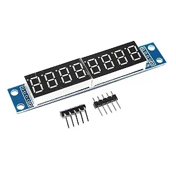

# Tutorial: 7-Segment Display (MAX7219 SPI)

This document describes the architecture and wiring required to control an 8-digit 7-segment numeric display using the MAX7219 driver via SPI protocol with an ESP32.

The circuit allows real-time display of numeric data, such as temperature and time, using only 3 data pins from the microcontroller.

## 📦 Parts List
- 1x ESP32 Microcontroller (30 or 38 pins)
- 1x 8-Digit 7-Segment Display Module (MAX7219 Driver)
- 5x Female-to-Female Jumpers

## 🔌 MAX7219 Pin Reference

<div align="center">
  
</div>

The module typically has 5 input pins on one end:

- VCC: Power Supply (Recommended 5V)
- GND: Ground
- DIN: Data Input (Data Signal)
- CS / LOAD: Chip Select (Device Selection)
- CLK: Clock (Synchronization)

## 🛠️ Wiring Guide (Step-by-Step)
The assembly uses the ESP32's Hardware SPI bus to ensure the highest update speed and lowest CPU consumption.

1. **Power Connection**
   - Connect the display's VCC pin to the ESP32's VIN (or 5V) pin.
   - Note: The MAX7219 operates best at 5V to ensure full LED brightness.
   - Connect the display's GND pin to any GND pin on the ESP32.

2. **Data Bus (SPI)**
   - Connect the display's DIN pin to GPIO 23 (ESP32's default MOSI).
   - Connect the display's CLK pin to GPIO 18 (ESP32's default SCK/Clock).

3. **Control (Chip Select)**
   - Connect the display's CS (or LOAD) pin to GPIO 5.

## ⚡ Safety Notes and Brightness
- **Brightness (Intensity)**: In the code, intensity can be adjusted from 0 to 15. Avoid using 15 for long periods if the display is powered directly from the ESP32's USB to avoid overloading the voltage regulator.
- **Current**: Each LED segment consumes current. With all 8 digits lit, consumption can reach ~150mA.

## 🧩 ESPHome YAML Example
Below is the configuration snippet to integrate the display. Note that the configuration is divided between the SPI bus and the display component.

```yaml
# SPI Bus Configuration
spi:
  clk_pin: 18
  mosi_pin: 23

# MAX7219 Display Configuration
display:
  - platform: max7219
    id: led_7seg
    cs_pin: 5
    num_chips: 1
    intensity: 7  # Medium brightness (0 to 15)
    lambda: |-
      auto time = id(relogio_sntp).now();
      
      // Data validation for safety
      if (!time.is_valid() || !id(dht_temp_01).has_state()) {
        it.print("--C --.--");
        return;
      }

      // Format: Temperature (XX.X) + Letter C + Time (HH.MM)
      // Example on display: 25.4C18.05
      it.printf("%2.1fC%02d.%02d", id(dht_temp_01).state, time.hour, time.minute);
```

**Engineer's Tip**: If the numbers appear "mirrored" or in the wrong order, check the `reverse_enable` option in the ESPHome documentation, although most 8-digit modules sold in the Brazilian market follow the standard in this tutorial.