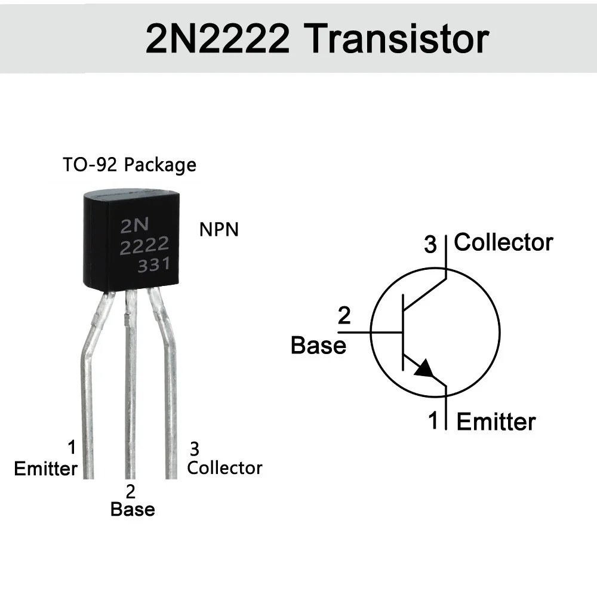
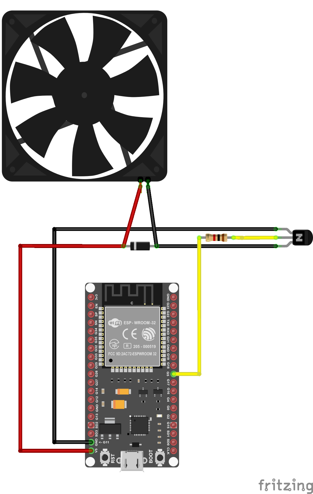

# Tutorial: Fan Controller Circuit (5V Cooler)

This document explains the architecture and wiring required to safely control a 5V fan (cooler) from a microcontroller (such as ESP32, Arduino, etc.) using a low-side switch configuration.

The circuit allows a low-current logic pin (3.3V or 5V) to act as a switch for a higher-power load (5V, ~200mA), isolating and protecting the microcontroller.

## 📦 Parts list

* **1x** Microcontroller (e.g. ESP32)
* **1x** 5V Cooling Fan (Model: LD3007MS)
* **1x** NPN transistor 2N2222 (power switch)
* **1x** 1K Ω resistor (base current limiter)
* **1x** 1N4007 diode (flyback / freewheeling diode)

---

## 🔌 2N2222 Pinout Reference

<div align="center">
  
</div>

Looking at the **flat face** of the 2N2222 (the side with text) with leads pointing down, the left-to-right order is:

1. **Emitter (E)**
2. **Base (B)**
3. **Collector (C)**

---

## 🛠️ Wiring Guide (Step-by-Step)

<div align="center">
  
</div>

The assembly uses a *Low-Side Switch* topology, where the transistor is placed between the load (fan) and ground (GND).

### 1. Signal connection (microcontroller → transistor)
* Connect the microcontroller digital output pin (e.g. `GPIO5`) to one end of the **1K Ω resistor**.
* Connect the other end of the **resistor** to the transistor middle pin: the **Base (B)**.

### 2. Ground connection (GND)
* Connect the transistor left pin, the **Emitter (E)**, directly to the microcontroller / power supply **GND**.

### 3. Load connection (fan)
* Connect the fan **red wire (positive)** directly to the 5V supply (e.g. `VIN` on ESP32).
* Connect the fan **black wire (negative)** to the transistor right pin: the **Collector (C)**.

### 4. Protection circuit (flyback diode)
⚠️ **ESSENTIAL:** Motors generate a reverse voltage spike when switched off. The diode protects the transistor and microcontroller from this electrical kick.
* Place the **1N4007 diode** in parallel with the fan leads.
* The **striped side (cathode)** goes to the fan **red wire (5V)**.
* The **non-striped side (anode)** goes to the fan **black wire (collector)**.

---

## ⚡ Safety and power notes
* **Transistor limit:** The 2N2222 can handle up to ~800mA continuous current. It is safe for LD3007MS (around 150-200mA).
* **Power supply:** If you run more than one fan, ensure the USB power supply can provide sufficient current (recommended 2A or higher) to avoid overloading the USB port.

---

## 🧩 ESPHome YAML Example

The following YAML example shows how to integrate the low-side fan switch in ESPHome. The transistor base is driven by `GPIO5`, and the fan is exposed as a switch and a fan entity.

```yaml
esphome:
  name: fan_controller
  platform: ESP32
  board: esp32dev

wifi:
  ssid: "YOUR_SSID"
  password: "YOUR_PASSWORD"

api:

ota:

logger:

# Output driving the transistor base
output:
  - platform: gpio
    pin: GPIO5
    id: fan_driver

# Optional switch to control the fan state
switch:
  - platform: output
    name: "5V Cooler Fan"
    output: fan_driver
    id: fan_switch

# Optional fan entity that supports speed control (on/off in this circuit)
fan:
  - platform: speed
    name: "Desk Cooler Fan"
    output: fan_driver
    id: fan_entity

# Optional sensor for measurement (example 5V rail voltage)
# sensor:
#   - platform: adc
#     pin: A0
#     name: "Fan Supply Voltage"
```

> Tip: If your fan requires simple on/off control only, the `switch` component is usually enough. If you want a UI with fan speeds, use `fan` plus PWM-compatible driver circuitry (e.g. MOSFET with PWM for true speed control).