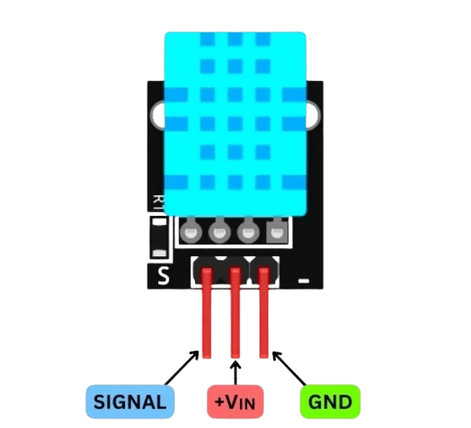

# Tutorial: DHT11 Temperature and Humidity Sensor

This guide explains how to connect and configure the DHT11 sensor module on your ESP32 Sensor Node.

## 1. Hardware Connection

Use the image below as a reference to connect the DHT11 module to your ESP32.



**Pinout & Connections:**

*   **SIGNAL (S/DATA):** Connect to **GPIO 21** (Pin D21 on ESP32).
*   **VCC (+):** Connect to **3.3V** (Recommended) or 5V.
*   **GND (-):** Connect to **GND**.

> **Note:** Most DHT11 modules (blue board) already have a built-in *pull-up* resistor. If you are using the "bare" sensor (without board), you will need to add a 4.7kΩ or 10kΩ resistor between VCC and the DATA pin.

## 2. ESPHome Configuration

Add the following code block to your `esphome-sensor-node.yaml` file. Ensure the pin number matches your physical connection.

```yaml
sensor:
  - platform: dht
    pin: 21  # GPIO where the DATA pin is connected
    model: DHT11
    temperature:
      name: "Sensor Node Temperature"
    humidity:
      name: "Sensor Node Humidity"
    update_interval: 60s
```

## 3. Troubleshooting

*   **"Communication failed" or "Invalid readings":**
    *   Check if wires are securely connected.
    *   Confirm if the pin in the code (`pin: 21`) matches the physical connection.
    *   If the sensor is white, change `model: DHT11` to `model: DHT22`.
*   **Incorrect readings (e.g. Nan or absurd values):**
    *   The cable might be too long.
    *   The ESP32 power supply might be unstable.